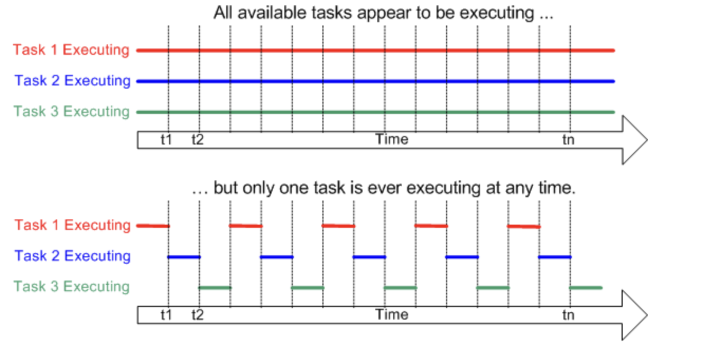
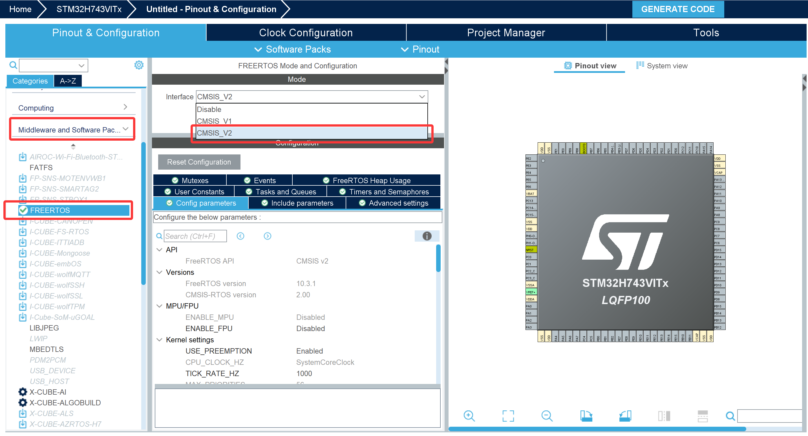
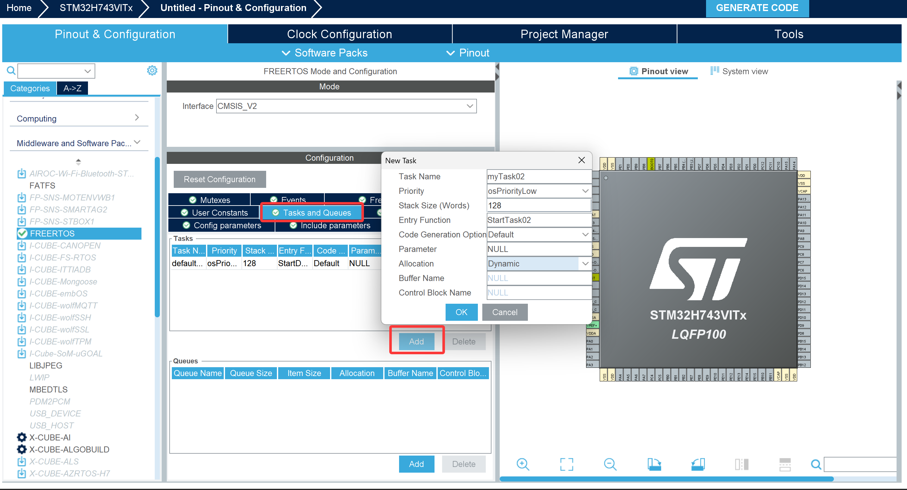

# FreeRTOS 入门培训 

## 一、初识 FreeRTOS 

### 什么是FreeRTOS？

FreeRTOS是一个**开源、小型、可移植**的实时操作系统（RTOS）内核，专为微控制器和嵌入式系统设计。自2003年发布以来，它已成为全球数百万设备的核心，尤其是在物联网（IoT）领域。FreeRTOS提供了一系列核心功能：任务管理、任务间通信、时间管理和内存管理等。

> 给FreeRTOS进行拆解：Free+RTOS

**Free：免费，自由(开源)**

**RTOS：实时操作系统(Real Time Operating System)**

### 什么是RTOS

RTOS 是**Real-Time Operating System**的缩写，即**实时操作系统**，是一种专为满足实时性要求设计的操作系统，核心目标是在规定的时间内对外部事件做出响应并完成处理，广泛应用于嵌入式系统、工业控制、汽车电子、航空航天等对响应时间有严格要求的领域。

RTOS 的最大优势：实现**多任务管理**，降低编程的难度  

使用RTOS内核的调度，让单核的MCU实现“看上去”的并行处理



除了FreeRTOS，还有很多优秀的RTOS，比如RT-Thread、UCOS等等。

###  嵌入式的两种开发方式：裸机 VS RTOS

**裸机开发（Super Loop）**

- 通常结构：

  ```c
  int main(void) {
      Hardware_Init();
      while (1) {
          Task1();
          Task2();
          Task3();
      }
  }
  ```

- 特点：

  - 所有功能堆在一个大循环中，**耦合严重**。
  - 某个函数阻塞或耗时过长，会导致其它功能“卡死”或响应极慢。
  - 难以处理多种不同实时性要求的任务。

**RTOS（Real-Time Operating System）**

- 将系统拆分为多个**任务（Task / Thread）**，每个任务专注做一件事。
- 内核负责**调度**任务，让它们看上去“并行”运行。
- 通过**优先级**、**时间片**等机制保证实时性。

**FreeRTOS**

- 轻量级、广泛使用的开源 RTOS 内核。
- 占用资源小，适合 MCU 使用。
- 社区成熟、资料丰富。

### 什么是CMSIS-RTOS 

CMSIS-RTOS 是ARM公司制定的一个**RTOS通用API标准**，它提供了一层**封装**，让你的应用程序可以**在不同兼容CMSIS-RTOS 的RTOS（如FreeRTOS、RTX等）之间无缝移植**，大大提高了代码的可复用性和可维护性。（就是在不同的RTOS之间提供一个通用的封装层）

与FreeRTOS原生API相比，CMSIS-RTOS 的优势在于：

- **标准化**：统一的API接口，降低学习成本
- **可移植性**：代码在不同RTOS间迁移更容易
- **中间件兼容性**：许多ARM生态的中间件直接支持CMSIS-RTOS v2

**STM32CubeMX内置的CMSIS-RTOS 的库，不需要我们繁杂地移植FreeRTOS内核**



---

## 二、任务管理 

### **任务（Task）的本质**

- 任务就是一个无限循环的函数。

### **任务状态机**

- 运行态（Running）、就绪态（Ready）、阻塞态（Blocked）、挂起态（Suspended）。

| 状态       | 描述                           | 关键 API / 事件                                       |
| ---------- | ------------------------------ | ----------------------------------------------------- |
| **运行态** | 正在 CPU 上执行                | 调度器切换                                            |
| **就绪态** | 等待 CPU 执行权                | `xTaskCreate()`, `vTaskResume()`, 事件唤醒            |
| **阻塞态** | 等待某个事件发生               | `vTaskDelay()`, `xQueueReceive()`, `xSemaphoreTake()` |
| **挂起态** | 被强制暂停                     | `vTaskSuspend()`, `vTaskResume()`                     |
| **删除态** | 任务被标记为删除并等待资源回收 | `vTaskDelete()`                                       |


### **任务优先级**

- 优先级数值的含义。
- FreeRTOS的调度策略：抢占式调度。

### **创建一个任务**



- **任务名称（Task Name）**：用于标识任务，如示例中的`myTask02`，是任务的唯一标识之一。
- **优先级（Priority）**：设置任务的执行优先级，示例中选择`osPriorityLow`（低优先级），优先级决定调度器选择任务的执行顺序。
- **栈大小（Stack Size (Words)）**：以 “字” 为单位配置任务栈的大小，示例中为`128`，栈用于存储任务的局部变量、函数调用上下文等。
- **入口函数（Entry Function）**：任务开始执行的函数，示例中为`StartTask02`，是任务的执行入口。
- **代码生成选项（Code Generation Option）**：示例中为`Default`，用于配置代码生成的策略。
- **参数（Parameter）**：传递给任务入口函数的参数，示例中为`NULL`（表示无参数）。
- **分配方式（Allocation）**：配置任务资源的分配模式，示例中为`Dynamic`（动态分配），也可选择静态分配等方式。

```C
//任务ID句柄（Handle，理解为操作任务的把手）
osThreadId_t LED1Handle; 
//任务属性配置结构体 (Attribute 属性)
const osThreadAttr_t LED1_attributes = {
  .name = "LED1",
  .stack_size = 128 * 4,
  .priority = (osPriority_t) osPriorityNormal,
};
//任务初始化 
LED1Handle = osThreadNew(LED1_Task, NULL, &LED1_attributes);
//任务函数的声明
void LED1_Task(void *argument);
//任务函数的实现
__weak void LED1_Task(void *argument)
{
  /* USER CODE BEGIN LED1_Task */
  /* Infinite loop */
  for(;;)
  {
    osDelay(1);
  }
  /* USER CODE END LED1_Task */
}
//若为虚函数，则可以在其他位置重复实现

```

 `osThreadId_t` - 任务句柄类型

```C
typedef void *osThreadId_t;
```

**作用**：任务的身份标识符，“Handle” 操作把手

- 类似于文件操作中的文件句柄
- 用于后续对任务进行管理和操作
- 每个任务都有唯一的`osThreadId_t`

 `osThreadAttr_t` - 任务属性结构体

```C
typedef struct {
  const char                   *name;       // 任务名称（字符串标识）
  uint32_t                 attr_bits;       // 属性位（保留，通常为0）
  void                      *cb_mem;        // 控制块内存（通常为NULL，自动分配）
  uint32_t                   cb_size;       // 控制块大小（通常为0）
  void                   *stack_mem;        // 堆栈内存（通常为NULL，自动分配）
  uint32_t                stack_size;       // 堆栈大小（字节）
  osPriority_t             priority;        // 任务优先级
  TZ_ModuleId_t            tz_module;       // TrustZone模块ID（安全扩展）
  uint32_t                  reserved;       // 保留字段
} osThreadAttr_t;
```

- `osKernelInitialize()`: 初始化 RTOS 内核。
- `osThreadNew()`: 创建一个新任务。
-  `osKernelStart()`: 启动调度器 (一旦启动，不再返回 `main` 函数)。
- `osDelay(n)`: 它会让当前任务进入**阻塞(Blocked)** 状态，CPU 会立即切换去运行其他就绪的任务。如果是裸机的 `HAL_Delay`，CPU 会在死循环里空转，浪费资源且无法切换任务。

> 定义任务函数 → 配置任务属性 → 定义任务句柄 → 把任务函数交给任务句柄 → 内核调度

### 任务管理

**任务创建与删除**

```C
// 创建新任务
osThreadId_t osThreadNew(osThreadFunc_t func, void *argument, const osThreadAttr_t *attr);

// 终止指定任务
osStatus_t osThreadTerminate(osThreadId_t thread_id);

// 终止当前任务
void osThreadExit(void);
```

**任务挂起与恢复**

```C
// 挂起指定任务（暂停执行）
osStatus_t osThreadSuspend(osThreadId_t thread_id);

// 恢复指定任务（继续执行）  
osStatus_t osThreadResume(osThreadId_t thread_id);
```

**任务状态控制**

```C
// 获取任务当前状态
osThreadState_t osThreadGetState(osThreadId_t thread_id);

// 让出CPU时间片（同优先级任务轮转）
osStatus_t osThreadYield(void);
```


## 三、消息队列

### 消息队列特性

**消息队列（Message Queue）**：RTOS 内核里的一块 FIFO 缓冲区，用来在任务之间传递固定大小的“消息单元”。

- 队列可以包含若干个数据：队列中有若干项，这被称为"长度"(length)
- 每个数据大小固定
- 创建队列时就要指定长度、数据大小
- 数据的操作采用先进先出的方法(FIFO，First In First Out)：写数据时放到尾部，读数据时从头部读
- 也可以强制写队列头部：覆盖头部数据

- 每个队列有两个关键参数：
  - `msg_count`：最多能存多少条消息。
  - `msg_size`：每条消息占多少字节（可以是 `uint32_t`、`enum`、`struct` 等）。

**典型使用模式**：

- 任务 A（生产者）`osMessageQueuePut` → 往队列塞一条消息
- 任务 B（消费者）`osMessageQueueGet` → 从队列取消息，阻塞/等待直到有消息


### 使用消息队列进行通信

**创建消息队列**

```C
osMessageQueueId_t osMessageQueueNew (uint32_t msg_count,
                                      uint32_t msg_size,
                                      const osMessageQueueAttr_t *attr);
```
**删除消息队列**

```C
osStatus_t osMessageQueueDelete (osMessageQueueId_t mq_id);
```
**放置消息**

```C
osStatus_t osMessageQueuePut (osMessageQueueId_t mq_id,
                              const void *msg_ptr,
                              uint8_t msg_prio,
                              uint32_t timeout);
```
- 参数说明：

  - `mq_id`：队列句柄。

  - `msg_ptr`：指向要发送的数据的指针（大小必须等于创建时的 `msg_size`）。

  - `msg_prio`：消息优先级（0 为普通，数值越大优先级越高，很多场景用 0 足够）。

  - `timeout`：当队列满时的等待时间：
    - `0`：不等待，满了就立即返回 `osErrorResource`。
    - `osWaitForever`：一直等到有空位。
  
- 其他值：等待指定毫秒数。
  
- 返回值常见值：

  - `osOK`：发送成功。

  - `osErrorResource`：队列满且不等待，或超时仍无空位。

  - `osErrorParameter`：参数错误。

  - `osErrorTimeout`：在 `timeout` 时间内一直满，最终超时。

**接收消息**

```C
osStatus_t osMessageQueueGet (osMessageQueueId_t mq_id,
                              void *msg_ptr,
                              uint8_t *msg_prio,
                              uint32_t timeout);
```

- 参数说明：

  - `mq_id`：队列句柄。

  - `msg_ptr`：接收消息的缓冲区指针，大小应 ≥ `msg_size`。

  - `msg_prio`：输出参数，返回这条消息的优先级；如不关心，可以传 `NULL`。

  - `timeout`：当队列为空时的等待时间：
    - `0`：不等待，若为空立即返回 `osErrorResource`。
    - `osWaitForever`：一直等到有消息。
    - 其他值：等待指定毫秒数。

- 返回值常见值：

  - `osOK`：成功取到一条消息。
  - `osErrorResource`：队列为空且不等待，或等待期间一直没有消息。
  - `osErrorTimeout`：等待超时。
  - `osErrorParameter`：参数错误。

示例：使用消息队列控制蜂鸣器

```C
#include "cmsis_os.h"
#include "main.h"

//声明队列句柄
osMessageQueueId_t buzz_stateHandle;
const osMessageQueueAttr_t buzz_attributes = {
  .name = "buzz"
};

void key_scan_Task(void *argument)
{

uint8_t k1_state = 1;	uint8_t k2_state = 1; uint8_t k1_state_last = 1;uint8_t k2_state_last = 1;
  for(;;)
  {
	k1_state = HAL_GPIO_ReadPin(GPIOE, GPIO_PIN_4);  
	k2_state = HAL_GPIO_ReadPin(GPIOE, GPIO_PIN_3);  

	if(!k1_state && k1_state_last)
	{
//		osThreadSuspend(LED1Handle);
	}	
	if(!k2_state && k2_state_last)
	{
//		osThreadResume(LED1Handle);
	}	
//	uint8_t led_on = (k1_state == 0) ? GPIO_PIN_RESET : GPIO_PIN_SET;
//    osMessageQueuePut(led_stateHandle, &led_on, 0, 0);
	
	uint8_t buzzer = k2_state;
    osMessageQueuePut(buzz_stateHandle, &buzzer, 0, 0);

	k1_state_last = k1_state;	k2_state_last = k2_state;
    osDelay(1);
  }
}

void Buzzer_Task(void *argument)
{
	uint8_t buzz = 0;
  buzz_stateHandle = osMessageQueueNew (16, sizeof(uint8_t), &buzz_attributes);	
	
  for(;;)
  {
    osStatus_t status = osMessageQueueGet(buzz_stateHandle, &buzz, NULL, 0);
	HAL_GPIO_WritePin(GPIOB, GPIO_PIN_8, !buzz);
    osDelay(1);
  }
}
```


[百问网《FreeRTOS入门与工程实践-基于STM32F103》教程-基于DShanMCU-103(STM32F103) | 百问网](https://rtos.100ask.net/zh/FreeRTOS/DShanMCU-F103/)

[[CMSIS-RTOS2: Overview](https://arm-software.github.io/CMSIS_6/latest/RTOS2/index.html)](https://arm-software.github.io/CMSIS_6/latest/General/index.html)

[[野火\]FreeRTOS 内核实现与应用开发实战—基于STM32 — FreeRTOS内核实现与应用开发实战指南—基于STM32 文档](https://doc.embedfire.com/rtos/freertos/zh/latest/index.html)

[FreeRTOS 初学者指南 - FreeRTOS™](https://blog.freertos.org/zh-cn-cmn-s/Documentation/01-FreeRTOS-quick-start/01-Beginners-guide/00-Overview)

