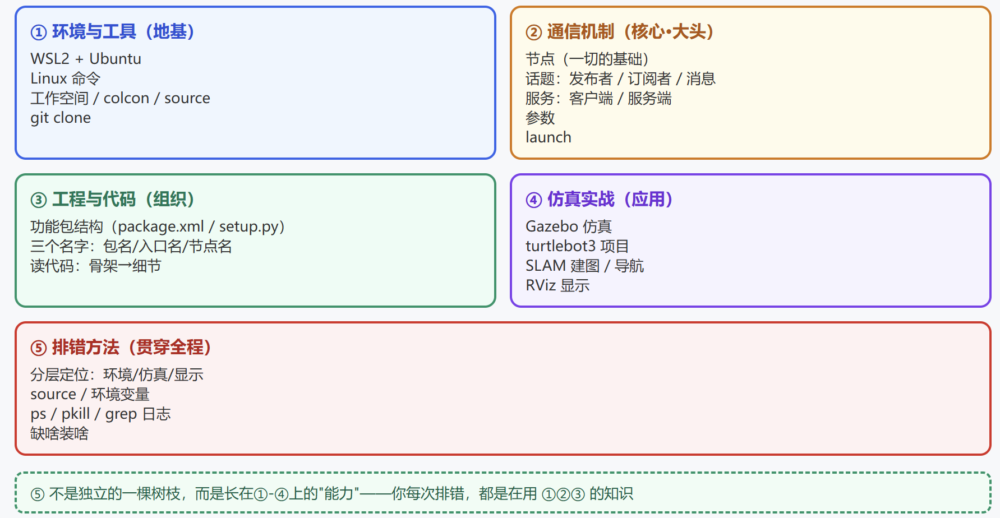

# ROS2 学习总览地图

> 这份笔记是**所有笔记的总索引**：把散落的知识点挂回 5 根"树枝"上，学新东西时先问"它属于哪根树枝"，就不会乱。
> 用途：① 复习时按树枝找回对应笔记；② 学新东西时按图归位；③ 面试前按图自查。

---

## 一、总览：ROS2学习五大板块



**为什么之前感觉乱**：知识按"时间线"进脑子（遇到什么学什么），没按"结构"进脑子。**乱 = 还没挂上树，不是知识多。**

---

## 二、五根树枝详解 + 对应笔记

### ① 环境与工具（地基）

> 一切的前提：能装、能跑、能改。

| 知识点 | 一句话 |
|--------|--------|
| WSL2 + Ubuntu（Linux系统安装） | Windows 里跑 Linux 的方式（免双系统） |
| Linux 命令 | 目录/文件/权限/进程/网络/安装 |
| 工作空间 | src/build/install/log 四件套 |
| colcon build | 编译（必须在工作空间根目录） |
| source | 让终端认识编译产物（新终端必做） |
| 环境变量 | export / .bashrc / TURTLEBOT3_MODEL |
| git | clone 开源项目、版本管理 |

### ② 通信机制（核心·大头）

> ROS 的灵魂：节点之间怎么说话。

| 知识点 | 一句话 |
|--------|--------|
| 节点 Node | 独立干活的小程序 |
| 话题 Topic | 广播频道（谁都能听） |
| 消息 Message | 频道里传的数据格式 |
| 发布者 | 主动喊（邮递员） |
| 订阅者 | 被动听（信箱） |
| 回调 Callback | 一触发就自动执行的函数 |
| 服务 Service | 一问一答（打电话） |
| 参数 Parameter | 节点的设置面板 |
| launch | 一条命令启动所有节点 |

### ③ 工程与代码（组织）

> 代码怎么放、怎么读、怎么认。

| 知识点 | 一句话 |
|--------|--------|
| 功能包结构 | package.xml=身份证，setup.py=工作证 |
| 三个名字 | 包名 / 入口名 / 节点名（别混） |
| 入口点 | `包名.文件名:main` 定位语法 |
| 读代码姿势 | 先骨架 → 再细节 → 找"我认识的" |
| 工程层级 | 工作空间 > 仓库 > 功能包 |

### ④ 仿真实战（应用）

> 把前 ①②③ 用起来的地方。

| 知识点 | 一句话 |
|--------|--------|
| Gazebo | 机器人虚拟练习场（物理+传感器） |
| 配置文件 | .world=房间图纸，.sdf=小车图纸 |
| turtlebot3 | 开源小车项目（两个仓库） |
| SLAM 建图 | 边定位边画地图 |
| 导航 | 拿着地图自己找路 |
| RViz | 把数据画出来看 |

### ⑤ 排错方法（贯穿全程的能力）

> 不是独立树枝，是长在①②③上的"功夫"。每次排错 = 用已有知识定位问题。

| 方法 | 一句话 | 例子 |
|------|--------|------|
| 分层定位 | 先问"哪一层的问题" | 环境层→source；仿真层→重启；显示层→换显示 |
| 缺啥装啥 | 报错说缺谁就装谁 | `Could not find xxx` → `sudo apt install ros-humble-xxx` |
| 查进程 | ps/grep/pkill 找卡死的程序 | `pkill -f gzserver` |
| 看日志 | 报错原文就是线索 | 搜 grep 关键词 |
| source 玄学 | 找不到包=没告诉系统东西在哪 | `source install/setup.bash` |

---

## 三、推荐学习顺序

```
① 环境与工具（能跑起来）
   ↓
② 通信机制（搞懂核心：话题→服务→参数→launch）
   ↓
③ 工程与代码（看懂包和代码）
   ↓
④ 仿真实战（turtlebot3：建图→导航）
   ↓
⑤ 排错（不是阶段，是全程随学随练）
```

---

## 四、挂树方法论（学新东西怎么不乱）

以后每遇到一个新知识点/新报错，先做这个动作：

```
问："这属于哪根树枝？"
 ├─ 是命令/环境/编译 → ①
 ├─ 是节点/话题/服务/参数/launch → ②
 ├─ 是包结构/代码/名字 → ③
 ├─ 是仿真/建图/导航/显示 → ④
 └─ 是报错/排查 → ⑤
```

**挂上树 = 有家 = 不乱。** 挂不上的，说明它可能是新树枝（比如以后学的 MoveIt 机械臂、ROS2 与硬件），到时再开新枝。

