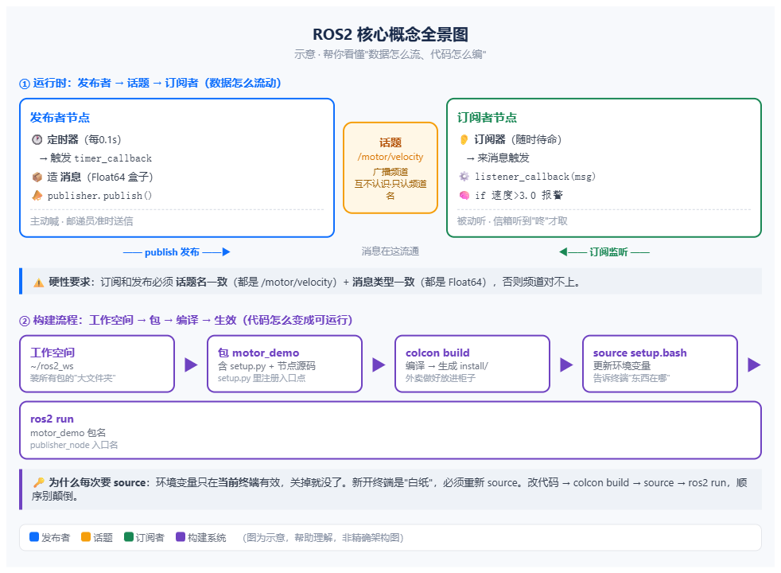

# ROS2 入门实践全流程教程

> 适用环境：Windows + WSL2 + Ubuntu 22.04 + ROS2 Humble + Python
> 读完你能做到：从零搭好环境，创建自己的功能包，写出发布、订阅、服务、参数四类节点，并理解它们背后的原理。

如果你之前完全没接触过 ROS，不用怕。这篇教程假设你只会最基本的 Python 语法，每个概念都会先讲"它是什么、为什么存在"，再给代码，最后让你亲手跑起来。

---

## 目录

- [第 0 章 环境准备：安装方式怎么选](#第-0-章-环境准备安装方式怎么选)
- [第 1 章 创建工作空间：所有代码的"家"](#第-1-章-创建工作空间所有代码的家)
- [第 2 章 创建功能包：ROS 的最小单位](#第-2-章-创建功能包ros-的最小单位)
- [第 3 章 第一个节点：发布者](#第-3-章-第一个节点发布者)
- [第 4 章 核心概念：发布-订阅机制](#第-4-章-核心概念发布-订阅机制)
- [第 5 章 第二个节点：订阅者](#第-5-章-第二个节点订阅者)
- [第 6 章 服务：一问一答](#第-6-章-服务一问一答)
- [第 7 章 参数：节点的设置面板](#第-7-章-参数节点的设置面板)
- [第 8 章 为什么每次都要 source？](#第-8-章-为什么每次都要-source)
- [第 9 章 常用命令速查](#第-9-章-常用命令速查)
- [第 10 章 常见问题与排查](#第-10-章-常见问题与排查)
- [第 11 章 概念速记](#第-11-章-概念速记)

---

## 第 0 章 环境准备：安装方式怎么选

ROS2 官方支持 Ubuntu，Windows 用户有几种办法用上它。先看对比，再决定：

| 安装方式 | 优点 | 缺点 | 适合人群 |
|---------|------|------|---------|
| **双系统** | 性能最好，环境最纯净 | 需重启切换，占硬盘空间，安装有风险 | 长期重度开发 |
| **虚拟机**（VMware/VirtualBox） | 完整 Linux 桌面，GUI 全功能 | 性能损耗大，占内存，启动慢 | 需要跑 Gazebo 等完整 3D 仿真 |
| **WSL2**（Windows 子系统） | 轻量、启动快、免重启、与 Windows 无缝共享文件 | 3D 仿真（Gazebo）性能一般 | **入门学习、写节点、跑小场景** |
| **Docker 容器** | 环境隔离，官方镜像现成 | 图形界面配置麻烦 | 部署/复现他人环境 |
| **云服务器 / 在线环境** | 零本地安装，随时可用 | 有网络延迟，需要付费或注册 | 快速体验、临时学习 |

**本文选择 WSL2**。它不需要重启切换系统，内存占用小，文件与 Windows 互通（在 Ubuntu 里访问 `/mnt/c/` 就能直接读写 C 盘），还能和 VS Code、MATLAB 等 Windows 工具共存。等以后需要完整 3D 仿真或真机部署时，再考虑虚拟机或开发板。

### 安装步骤（实测流程）

以管理员身份打开 PowerShell，依次执行：

**第 1 步：启用 WSL 并安装默认发行版**

```powershell
wsl --install
```

**第 2 步：安装 Ubuntu 22.04**

```powershell
wsl --install -d Ubuntu-22.04
```

完成后按提示重启电脑，并设置 Ubuntu 的用户名和密码（这个用户名要记住，后面很多路径会用到）。

**第 3 步：安装 ROS2（鱼香ROS 一键脚本）**

打开 Ubuntu 终端（开始菜单里搜索 Ubuntu），执行：

```bash
wget http://fishros.com/install -O fishros && bash fishros
```

运行后按脚本提示选择安装内容（选 ROS2 及对应版本，如 Humble），脚本会自动完成 ROS2 的安装与环境配置。

> 鱼香ROS（FishROS）是中文 ROS 社区常用的一键安装工具，对国内网络友好，省去了手动配置软件源和逐项安装依赖的步骤。

### 安装前置自查

装之前确认两件事，否则可能装到一半出问题：

- **Windows 版本**：Win10 21H2 或 Win11
- **虚拟化已开启**：任务管理器 → 性能 → CPU → 看右下角"虚拟化"是否显示"已启用"。没开启的话需要进 BIOS 打开 VT-x / AMD-V

### 验证安装

装好后打开 Ubuntu 终端，执行：

```bash
source /opt/ros/*/setup.bash
echo $ROS_DISTRO
```

能看到 `humble`（或对应版本名）说明 ROS2 已经可用，可以进入下一章了。

---

## 第 1 章 创建工作空间：所有代码的"家"

工作空间（Workspace）就是存放所有功能包的"大文件夹"。你的所有 ROS 项目代码都会放在这里。

```bash
mkdir -p ~/ros2_ws/src
cd ~/ros2_ws
```

创建后目录里会有三个文件夹，各司其职：

| 目录 | 作用 |
|------|------|
| `src/` | 放源码包（你写的代码都在这） |
| `build/` | 编译的中间产物（不用管） |
| `install/` | 编译好的成品（系统从这里找你的包） |
| `log/` | 编译日志（出错时来这里查） |

> `src/` 是你自己创建的，`build/`、`install/`、`log/` 会在你编译后自动生成。

---

## 第 2 章 创建功能包：ROS 的最小单位

功能包（Package）是 ROS 代码的最小组织单位，可以理解成一个"项目文件夹"。一个包里放着一组相关的节点和配置。

```bash
cd ~/ros2_ws/src
ros2 pkg create --build-type ament_python motor_demo
```

这条命令创建了一个叫 `motor_demo` 的 Python 包。创建后的结构：

```
motor_demo/
├── setup.py          # 打包配置 + 入口点注册（重点，后面细讲）
├── package.xml       # 包的信息和依赖
├── resource/         # 资源标记
└── motor_demo/       # Python 源码目录（与包同名）
    └── __init__.py
```

> ⚠️ 注意这里有个**同名嵌套目录**：外层 `motor_demo/` 是 ROS 功能包（`package.xml` 所在），内层 `motor_demo/motor_demo/` 是 Python 源码目录（`.py` 文件所在）。两个 `motor_demo` 含义不同，新手经常在这里绕晕，后面讲 `setup.py` 时会再遇到。

---

## 第 3 章 第一个节点：发布者

现在开始写第一个节点。我们会模拟一台"电机编码器"，每隔 0.1 秒发布一次当前速度值。

### 3.1 写代码

文件：`motor_demo/motor_demo/publisher_node.py`

```python
import rclpy                      # ROS 本体
from rclpy.node import Node       # 节点工具
from std_msgs.msg import Float64  # 消息类型：一个浮点数
import random                     # 随机数工具

class MotorEncoderPublisher(Node):            # 定义节点，继承自 Node
    def __init__(self):
        super().__init__('motor_encoder_publisher')  # 给节点起名

        # 创建发布者：往 /motor/velocity 话题发 Float64 消息
        self.publisher = self.create_publisher(Float64, '/motor/velocity', 10)
        # 创建定时器：每 0.1 秒执行一次 timer_callback
        self.timer = self.create_timer(0.1, self.timer_callback)
        self.velocity = 0.0                    # 速度初始值

    def timer_callback(self):                 # 闹钟响时干活
        self.velocity += random.uniform(-0.05, 0.05)  # 加个小随机数，模拟真实波动
        msg = Float64()                       # 造一个消息
        msg.data = self.velocity              # 把速度值放进去
        self.publisher.publish(msg)           # 发布出去

def main(args=None):
    rclpy.init(args=args)                     # 启动 ROS 系统
    node = MotorEncoderPublisher()            # 创建节点
    rclpy.spin(node)                          # 让节点持续运行，等闹钟响

if __name__ == '__main__':
    main()
```

### 3.2 逐段读懂这份代码

代码不复杂，一共就五块，每一块对应一个职责：

| 代码块 | 作用 |
|--------|------|
| `import ...` | 从工具箱拿工具。前三行是 ROS 的，`random` 是 Python 自带的随机数工具 |
| `class MotorEncoderPublisher(Node)` + `__init__` | 定义节点、起名字。`super().__init__('xxx')` 里的字符串就是**节点名** |
| `create_publisher(Float64, '/motor/velocity', 10)` | 造一个"发布器"，声明"我要往这个话题发一个浮点数"。三个参数：消息类型、话题名、缓冲区 |
| `create_timer(0.1, self.timer_callback)` | 造一个"定时器"，每 0.1 秒自动调用一次回调函数 |
| `main()` + `if __name__ == '__main__'` | 程序入口。`rclpy.spin(node)` 让节点一直运行，直到你按 Ctrl+C |

两个暂时不用深究的点，但先认识它们：

**话题名为什么带斜杠 `/motor/velocity`？**
斜杠表示**层级结构**，就像文件夹路径。`/motor/velocity` 的意思是"motor 这个设备下的 velocity 数据"。以后话题多了能整齐分类：`/motor/velocity`、`/motor/position`、`/imu/accel`……一眼看出每个话题属于哪个设备。开头的 `/` 表示"全局话题"，规范的话题都从 `/` 开始。

**缓冲区 10 是什么？**
消息会先排进"最多装 10 条"的队列再发出。如果接收方处理慢了，新消息会**挤掉最旧的消息**，不会无限堆积。为什么这样设计？因为对速度这类实时数据来说，"最新的值"比"一堆积压的旧值"有用得多——宁可丢旧保新。

### 3.3 注册入口点（新手最容易卡的一步）

直接运行 `ros2 run motor_demo publisher_node` 会报 "No executable found"。原因是：新建的 Python 包默认**没有注册可执行入口**，ROS 不知道 `publisher_node` 这个命令对应哪个文件。

打开 `motor_demo/setup.py`，找到 `entry_points`：

```python
entry_points={
    'console_scripts': [
        'publisher_node = motor_demo.publisher_node:main',
        #   ↑入口名(ros2 run敲的) ↑定位路径: 源码目录.文件名:函数
    ],
},
```

这行 `'publisher_node = motor_demo.publisher_node:main'` 是一个**定位地址**，拆开看：

```
motor_demo  .  publisher_node  :  main
   ↑            ↑                ↑
Python包名     Python文件名      函数名
（源码目录）   （不含 .py）       （程序入口）
```

翻译成大白话：**"到 motor_demo 这个源码目录里，打开 publisher_node.py 这个文件，从它的 main() 函数开始跑。"**

这里再次出现两个 `motor_demo`，含义不同：

```
~/ros2_ws/src/motor_demo/            # 外层：ROS 功能包（package.xml 所在）
~/ros2_ws/src/motor_demo/motor_demo/ # 内层：Python 源码目录（.py 所在）
```

`ros2 run` 里的 `motor_demo` 是外层 ROS 功能包名；`:main` 左边的 `motor_demo` 是内层 Python 包名。两者恰好同名，是 ament_python 的默认结构。

### 3.4 编译、生效、运行

```bash
cd ~/ros2_ws
colcon build
source install/setup.bash
ros2 run motor_demo publisher_node
```

运行后终端会不断打印 `发布速度: x.xxx rad/s`，数字一直在变——因为每 0.1 秒在旧值上加了一个小随机数，模拟真实电机的转速波动。按 Ctrl+C 停止。

---

## 第 4 章 核心概念：发布-订阅机制

跑通了第一个节点，现在把背后的机制讲透。ROS 的一切都建立在**发布-订阅**之上：

> **一个节点把数据"喊出来"（发布），其他节点能"听到"（订阅）。喊的内容叫"话题"，话题里传的数据叫"消息"。**

三个核心概念：

| 概念 | 通俗理解 | 代码里的对应 |
|------|---------|-------------|
| **节点 Node** | 一个独立干活的小程序 | `class ...(Node)` |
| **话题 Topic** | 一条广播频道，谁都能听 | `'/motor/velocity'` |
| **消息 Message** | 频道里传的数据格式 | `Float64`（一个数） |

**精髓在于"解耦"**：喊话的人和听话的人**互不认识**，只通过频道名对接。发布者不知道谁在听，订阅者也不知道谁在喊。这样好处很大——以后加 10 个节点，只要都知道频道名，就能自由互通，互不影响。

打个比方：

> **发布者 = 邮递员**，每 10 分钟准时送一封信（不管收件人在不在）。
> **订阅者 = 家门口的信箱**，听到"咚"一声才去取信。它不主动去问"有信没"，信来了自然触发它去取。

这个"信来了自动执行"的机制，就是**回调（Callback）**——ROS 的核心异步机制。你不用写循环去轮询，只管"定义好到时候该干什么"，ROS 负责"什么时候叫醒你"。

发布者和订阅者的触发方式对比：

| | 发布者 | 订阅者 |
|---|---|---|
| 触发方式 | 闹钟定时（timer） | 监听器待命（subscription） |
| 动作 | 主动喊话 | 被动接收 |
| 回调函数 | `timer_callback` | `listener_callback` |



---

## 第 5 章 第二个节点：订阅者

现在写一个订阅者，监听 `/motor/velocity` 话题，把收到的速度打印出来——这就是你的程序真正在"听"了。

### 5.1 写代码

文件：`motor_demo/motor_demo/subscriber_node.py`

```python
import rclpy
from rclpy.node import Node
from std_msgs.msg import Float64

class MotorSubscriber(Node):
    def __init__(self):
        super().__init__('motor_subscriber')
        # 创建订阅者：监听 /motor/velocity，来消息自动调 listener_callback
        self.subscription = self.create_subscription(
            Float64,                  # 消息类型（必须与发布者一致）
            '/motor/velocity',        # 话题名（必须与发布者一致）
            self.listener_callback,   # 收到消息后执行的函数
            10                        # 缓冲区
        )

    def listener_callback(self, msg):
        # 有消息来了，自动执行这里
        self.get_logger().info(f'收到速度: {msg.data:.3f} rad/s')

def main(args=None):
    rclpy.init(args=args)
    node = MotorSubscriber()
    rclpy.spin(node)
    node.destroy_node()
    rclpy.shutdown()

if __name__ == '__main__':
    main()
```

注意和发布者的一个关键区别：**发布者用 `timer`（定时器）主动喊，订阅者用 `subscription`（订阅器）被动等**。订阅者没有定时器，它只"挂着"，消息一来自动触发回调。

**硬性要求**：订阅方和发布方必须**话题名一致**（都是 `/motor/velocity`）+ **消息类型一致**（都是 `Float64`），否则频道对不上，谁也听不到谁。

### 5.2 注册入口点 + 编译

在 `setup.py` 的 `console_scripts` 里**追加**一行：

```python
'subscriber_node = motor_demo.subscriber_node:main',
```

> ⚠️ **新增入口点后必须重新 source**，否则会报 "No executable found"。原因见第 8 章。

```bash
cd ~/ros2_ws
colcon build
source install/setup.bash
```

### 5.3 运行验证

开两个终端：

```bash
# 终端1：发布者
ros2 run motor_demo publisher_node
# 终端2：订阅者
ros2 run motor_demo subscriber_node
```

终端2 会不断打印 `收到速度: x.xxx rad/s`，数值和终端1 发布的一致——发布-订阅闭环跑通了。

配套命令行工具（不用写代码就能观察系统）：

```bash
ros2 node list                       # 查看运行中的节点
ros2 topic list                      # 查看所有话题
ros2 topic echo /motor/velocity      # 命令行直接"监听"某个话题
ros2 topic info /motor/velocity      # 查看话题信息
```

---

## 第 6 章 服务：一问一答

话题适合"持续不断的数据流"，但有些场景需要**一问一答**：你问一个问题，马上拿到一个结果。比如"现在温度多少？""帮我算一下 1+1"。这时候用**服务（Service）**。

打个比方：话题是**广播**，服务是**打电话**——客户端打进来，服务端接听回答；服务端永远不会主动打电话给客户端。

| | 话题 | 服务 |
|---|---|---|
| 角色 | 发布者 → 订阅者 | 客户端 → 服务端 |
| 数据方向 | 单向广播 | 双向：请求 + 响应 |
| 触发 | 定时/来消息 | 客户端主动发问 |
| 典型场景 | 传感器数据流 | 查询/计算/设置 |

### 6.1 服务端

服务端负责"接电话、回答问题"。下面这个服务端提供加法：客户端发来 `a` 和 `b`，它返回 `sum = a + b`。

文件：`motor_demo/motor_demo/add_service.py`

```python
import rclpy
from rclpy.node import Node
from example_interfaces.srv import AddTwoInts   # 现成的"加法服务"消息类型

class AddService(Node):
    def __init__(self):
        super().__init__('add_service')
        self.srv = self.create_service(
            AddTwoInts,       # 服务消息类型
            'add_two_ints',   # 服务名
            self.add_callback # 收到请求时执行的函数
        )

    def add_callback(self, request, response):
        response.sum = request.a + request.b   # 计算答案放进 response
        self.get_logger().info(f'{request.a} + {request.b} = {response.sum}')
        return response       # 把答案还回去（服务的关键）

def main(args=None):
    rclpy.init(args=args)
    node = AddService()
    rclpy.spin(node)
    rclpy.shutdown()

if __name__ == '__main__':
    main()
```

和订阅回调的区别：订阅回调只有 `msg`（只收不回）；**服务回调有 `request` + `response` 两个参数**（收问题、填答案），最后 `return response` 把答案还回去。

### 6.2 客户端

客户端负责"拨电话、问问题"。这个客户端会自动问 `3 + 5 = ?`。

文件：`motor_demo/motor_demo/client_node.py`

```python
import rclpy
from rclpy.node import Node
from example_interfaces.srv import AddTwoInts

class AddClient(Node):
    def __init__(self):
        super().__init__('add_client')
        self.client = self.create_client(AddTwoInts, 'add_two_ints')

        # 等待服务端上线（对方没接就一直等）
        while not self.client.wait_for_service(timeout_sec=1.0):
            self.get_logger().info('等待服务端上线...')

        # 构造请求
        self.req = AddTwoInts.Request()   # 注意：存到 self 上，回调才能访问
        self.req.a = 3
        self.req.b = 5

        # 异步发请求，答案到了触发回调
        self.future = self.client.call_async(self.req)
        self.future.add_done_callback(self.response_callback)

    def response_callback(self, future):
        response = future.result()
        self.get_logger().info(f'收到答案: {self.req.a} + {self.req.b} = {response.sum}')

def main(args=None):
    rclpy.init(args=args)
    node = AddClient()
    rclpy.spin(node)
    rclpy.shutdown()

if __name__ == '__main__':
    main()
```

客户端有三步，对应"打电话"的三个动作：

| 代码 | 对应动作 |
|------|---------|
| `wait_for_service()` | 拨号前确认对方在不在。服务端和客户端是独立启动的，客户端先跑时服务端可能还不存在，所以要等 |
| `call_async()` | 发请求（异步：发出去就返回，不等答案） |
| `add_done_callback()` | 答案到了自动执行回调（和订阅回调思想一样，只是触发条件从"来消息"变成"答案到了"） |

两个细节：
- `self.req` 为什么要加 `self.`？因为回调函数和 `__init__` 是两个函数，函数里定义的局部变量跨函数就消失了，必须存到 `self` 上才能共享。**规律：`self.xxx` = 节点随身携带的属性，任何回调都能访问。**
- `future` 可以理解成"回执单"：`call_async` 先给你一张空单子，答案到了才填进去，然后触发回调。

### 6.3 注册 + 运行

```python
'add_service = motor_demo.add_service:main',
'client_node = motor_demo.client_node:main',
```

```bash
cd ~/ros2_ws && colcon build && source install/setup.bash
```

开三个终端：

```bash
# 终端1：服务端
ros2 run motor_demo add_service
# 终端2：代码客户端（自动问 3+5）
ros2 run motor_demo client_node
# 终端3：命令行客户端（手动问 8+12）
ros2 service call /add_two_ints example_interfaces/srv/AddTwoInts "{a: 8, b: 12}"
```

预期：终端1 打印两次加法结果（`3 + 5 = 8` 和 `8 + 12 = 20`），终端2 打印"收到答案: 8"，终端3 返回 `sum: 20`。

---

## 第 7 章 参数：节点的设置面板

有些值需要"时不时调一下"，比如报警阈值、发布频率、电机名字。如果每次都改代码、重新编译，太麻烦了。ROS 用**参数（Parameter）**解决这个问题：参数是节点的"设置面板"，**运行中可以直接改，不用改代码、不用重启**。

### 7.1 核心两行

```python
self.declare_parameter('noise_range', 0.05)   # 声明参数 + 默认值
noise = self.get_parameter('noise_range').value  # 读取参数（.value 不能漏）
```

- `declare_parameter`：**声明**参数。必须先用这个，ROS 才知道有这个参数存在
- `get_parameter(...).value`：**读取**参数当前值。`.value` 不能漏，漏了拿到的是对象而不是数字

> ⚠️ `declare_parameter` 必须在 `super().__init__()` **之后**调用。因为 `super().__init__()` 负责完成节点的初始化（包括参数系统），没初始化就用参数会报 `AttributeError: no attribute '_parameter_overrides'`。

### 7.2 改造成可调参数的发布者

把第 3 章的发布者改造一下，让"速度波动范围"变成参数：

```python
import rclpy
from rclpy.node import Node
from std_msgs.msg import Float64
import random

class MotorEncoderPublisher(Node):
    def __init__(self):
        super().__init__('motor_encoder_publisher')
        # 声明参数：名字 noise_range，默认 0.05
        self.declare_parameter('noise_range', 0.05)

        self.publisher = self.create_publisher(Float64, '/motor/velocity', 10)
        self.timer = self.create_timer(0.1, self.timer_callback)
        self.velocity = 0.0

    def timer_callback(self):
        # 每次回调都重新读参数，保证 ros2 param set 立即生效
        noise = self.get_parameter('noise_range').value
        self.velocity += random.uniform(-noise, noise)
        msg = Float64()
        msg.data = self.velocity
        self.publisher.publish(msg)

def main(args=None):
    rclpy.init(args=args)
    node = MotorEncoderPublisher()
    rclpy.spin(node)
    rclpy.shutdown()

if __name__ == '__main__':
    main()
```

### 7.3 命令行操作参数

```bash
# 先跑起来
ros2 run motor_demo publisher_node
```

另一个终端：

```bash
ros2 param list /motor_encoder_publisher              # 查看所有参数
ros2 param get /motor_encoder_publisher noise_range   # 查看某个参数
ros2 param set /motor_encoder_publisher noise_range 2.0  # 运行中修改参数
```

改完之后，第一个终端里速度的波动会立刻变大——参数的意义就在这里：**不停程序、不改代码、动态调配置**。

> ⚠️ 参数是**被动**的：`param set` 只改了参数库里的值，节点必须**主动重新 `get_parameter`** 才能拿到新值。所以回调里要每次现读（上面代码就是这么写的）。如果只在 `__init__` 里读一次存起来，那 `param set` 后节点还抱着旧值，波动不会有变化——这是个很常见的坑。

---

## 第 8 章 为什么每次都要 source？

学到这里你可能已经困惑：`colcon build` 和 `source install/setup.bash` 每次都一起敲，它们到底各自干什么？能不能少敲一个？

先看各自的作用：

| 命令 | 干什么 | 类比 |
|------|--------|------|
| `colcon build` | 把你写的代码**翻译**成机器能运行的文件，放进 `install/` | **做好外卖放进柜子** |
| `source install/setup.bash` | 把"新东西在哪"这个信息**告诉当前终端** | **外卖员告诉你柜子在哪** |

关键区别：**编译是"制造"，source 是"指路"。** 编译只是把东西做好了，但当前终端默认不知道"外卖柜"在哪——ROS 只认识它原本就知道的几个位置。你新编译的包在一个系统"眼生"的地方，必须 source 一下告诉它"东西在这"。

**为什么每次新开终端都要重新 source？** 因为环境变量不是永久的，它只活在"当前终端"里：

- 环境变量 = 一张"地址纸条"，写着去哪找 ROS 的东西
- source 一次 = 把纸条贴在这条终端上
- **关掉终端，纸条就没了** → 新终端是一张白纸，又不知道地址了

验证一下，加深理解：

```bash
# 先 source 过的终端
ros2 pkg list | grep motor_demo    # 能看到 motor_demo

# 新开一个终端（没 source）
ros2 pkg list | grep motor_demo    # 看不到！因为新终端是"白纸"
```

你之前遇到的 `ros2 run` 报 "No executable found"，表面看是"找不到入口"，本质是——**ROS 根本没找到你的包**，因为你 build 完没 source，系统不知道 `motor_demo` 存在。

**什么情况下 build 后必须重新 source？**

| 你做了什么 | 需要重新 source 吗 |
|-----------|-------------------|
| 只改 `.py` 文件里的代码逻辑 | ❌ 不用（build 完直接跑） |
| **改 `setup.py` 的入口点** | ✅ **必须** |
| **新建一个包** | ✅ **必须** |

原因：改代码只是"更新旧东西"（位置没变，终端已经知道在哪）；新增入口/新包是"引入新东西"（环境变量里还没有它），必须重新 source 才被发现。

**规律**：改代码 → `colcon build` → （改入口/新包才需）`source` → `ros2 run`。缺一不可，顺序也别颠倒。

如果嫌麻烦，可以把 source 写进 `~/.bashrc`（每个新终端自动执行），一劳永逸，见第 10 章的自动化配置。

---

## 第 9 章 常用命令速查

```bash
# 工作空间 / 包
colcon build                          # 编译（必须 cd 到工作空间根目录）
source install/setup.bash             # 让终端认识编译产物
ros2 pkg list | grep 包名             # 查看包是否存在

# 节点
ros2 node list                        # 查看运行节点
ros2 run 包名 入口名                  # 运行节点

# 话题
ros2 topic list                       # 列出所有话题
ros2 topic echo 话题名                # 监听某个话题
ros2 topic info 话题名                # 查看话题信息

# 服务
ros2 service list                     # 查看所有服务
ros2 service call 服务名 类型 "{参数}"  # 命令行调用服务

# 参数
ros2 param list 节点名                # 查看节点所有参数
ros2 param get 节点名 参数名          # 读取参数
ros2 param set 节点名 参数名 值       # 修改参数
```

---

## 第 10 章 常见问题与排查

| 问题 | 原因 | 解决 |
|------|------|------|
| `ros2 run` 报 "Package not found" | 没 source / 包名拼错 | `source install/setup.bash` |
| 报 "No executable found" | **新增入口点后没重新 source** | 改 setup.py → build → **source** |
| `AttributeError: '_parameter_overrides'` | `declare_parameter` 在 `super().__init__()` 前 | `super().__init__()` 必须放第一行 |
| `NameError: name 'req' is not defined` | 局部变量跨函数不可见 | 存到 `self.req` |
| `param set` 后波动没变化 | 参数是被动机制，没重新读 | 回调里每次 `get_parameter` |
| 根目录 build "成功"但包找不到 | colcon 只找当前目录的 `src/` | 确认 `pwd`，在 `~/ros2_ws` 下 build |
| 改代码后还要不要 source？ | 分情况 | 只改代码→不用；**改入口点/新包→必须** |

---

## 第 11 章 概念速记

**三个名字（最容易混）：**

```
包名（Package）：ros2 pkg create 时定的，装代码的"项目文件夹"
入口名（Executable）：setup.py console_scripts 里定义的，ros2 run 敲的词
节点名（Node）：代码 super().__init__('xxx') 定的，ros2 node list 显示的

入口名 ≠ 节点名：ros2 run 用的是入口名，系统里登记的是节点名
```

**四大机制：**

```
话题：广播频道（发布者→订阅者，单向，互不认识，靠频道名对接）
服务：问答（客户端→服务端，请求+响应，双向）
参数：设置面板（节点的可调配置，被动，需主动重读）
回调：一触发就自动执行的函数（ROS 负责"叫醒你"）
```

**编译流程：**

```
改代码 → colcon build → （改入口/新包才需）source → ros2 run
```

**自动化配置（可选，一劳永逸）：**

把 source 写进 `.bashrc`，新终端自动生效：

```bash
echo "source ~/ros2_ws/install/setup.bash" >> ~/.bashrc
source ~/.bashrc
```

编译快捷命令（改完代码一键编译+生效）：

```bash
echo "alias rb='cd ~/ros2_ws && colcon build && source install/setup.bash'" >> ~/.bashrc
source ~/.bashrc
```
